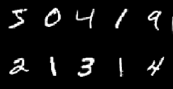

# Handwritten Digit Recognizer using CNN with GUI 
* Data science project with GUI that uses deep learning model: Convolutional Neural Network (CNN) to recognize handwritten digits.
* In this project will apply supervised learning technique (multiclass classification) on image data from keras datasets, aiming to predict the number in the handwritten digit entered by the user.

